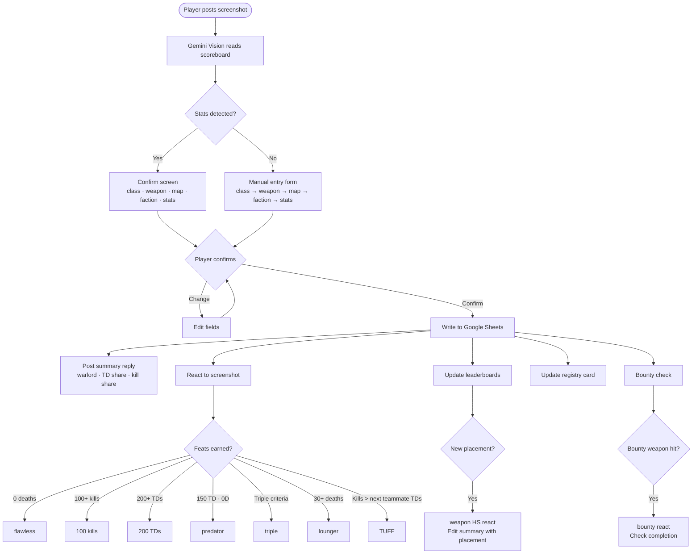

# 🎩 The Butler

> *The lounge does not run itself.*

A Discord bot for the **Cigar Lounge**, a competitive [Chivalry 2](https://www.chivalry2.com/) community. The Butler handles the full submission and tracking pipeline: players post in-game scorecards, and the bot takes it from there.

---

## Features

### 📋 Submission Flow
Players post a screenshot of their in-game scorecard. Vision AI (Gemini) reads the stats automatically. Players confirm class and weapon, then the Butler logs the run to Google Sheets. Includes VIP detection, triple-kill verification, emoji reactions, and a formatted confirmation reply with an edit button. Vision failures fall back to a manual entry form.

The submission blurb includes live team context parsed from the scoreboard image: warlord emoji + TD share percentage, kill share percentage with lethality emoji, and feat reactions for notable runs.

### 🏆 Leaderboards
Live weapon leaderboards for all 1H and 2H weapons, plus map boards and feat boards. Multi-message chunking handles large boards. Shared weapons across subclasses are deduplicated by `(weapon, subclass)` key.

### 📇 Registry Cards
Per-player forum threads in the Butler's Archive. Weapon marks are merged from live submissions, leaderboard data, and legacy records. Includes class rank progression, personal bests, and Best Placements sorted by dominance gap (gap between 1st and 2nd place). `/repair_marks` backfills missing High Score marks in bulk.

### 🎖️ Butler's Report
Weekly stats and all-time prestige titles posted as a Discord embed. Titles recalculated after every submission -- one holder per title at a time. Weekly stats reset each Monday.

| Title | Criteria |
|---|---|
| **Grand Marshal** | Most leaderboard breadth -- 15+ boards across all categories, ranked by average placement |
| **Weapons Master** | 9+ weapon leaderboards, ranked by average placement |
| **Campaign Master** | 6+ map leaderboards, ranked by average placement |
| **Headhunter** | #1 on the 100 Kills board, ranked by average kills weighted by submission count |
| **Butcher** | #1 on the 200 Takedowns board, ranked by average takedowns weighted by submission count |

Weekly stats include Lethality Rating, Warlord (TD/kill ratio), Busiest player, Top Weapons, and Top Maps -- all with a 3-run minimum.

### 🎯 Bounty System
Monthly bounty cards with per-player progress tracking, a live Top Hunters board, and archival on completion. Supports per-weapon custom targets. Player commands: `/bounty_hunt`, `/my_bounty`, `/bounty_status`.

### 🗂 Ledger Entrance
A master index channel linking to every forum section: 1H weapons, 2H weapons, maps, feats, bounty cards, and the player registry. Weapon indexes are grouped by class rather than alphabetically. Rebuilt automatically after leaderboard updates and on demand via `/ledger_refresh`.

### 🧠 Nerve Center Digest
Hourly summary posted to a private channel covering submissions, milestones, Butler interactions, and errors. Silent when there is nothing to report.

### ⚠️ Anomaly Detection
Flags suspicious runs to a private notes channel when stats exceed 2x the server record or a leaderboard gap exceeds 80%. `/remove_submission` rolls back fraudulent entries.

### 🃏 Butler Personality
Dry, sardonic responses to pings and unprompted one-liners in the main channel every few hours. Dry-spell warnings after 48 hours of inactivity. Answers player questions about stats, leaderboard standings, and Hundred Handed progress using live sheet data as context. Powered by Claude Haiku.

---

## Tech Stack

| Layer | Tool |
|---|---|
| Language | Python 3.11 |
| Bot framework | discord.py 2.x |
| Data | Google Sheets (gspread) |
| AI — Butler chat | Anthropic Claude Haiku |
| AI — Scoreboard vision | Google Gemini Flash |
| Hosting | Railway (auto-deploy on push) |
| Version control | GitHub |

---

## Architecture Notes

- **Submission queue** serialises concurrent submissions per guild to prevent race conditions
- **SheetCache** TTL class reduces Sheets API calls; invalidated on writes
- **Registry cards** edited in-place (never deleted or recreated) for stable thread ID references
- **Shared weapons** keyed as `(weapon, subclass)` tuples to prevent double-counting across subclasses
- **Discord cache** falls back to `fetch_channel()` / `fetch_thread()` after restarts
- **Bulk imports** suppress per-card updates and milestone announcements; index rebuilt once at completion
- **Google Sheets IDs** stored as plain text to prevent 18-digit snowflake corruption

---

*Private repository. Not open for contributions.*
