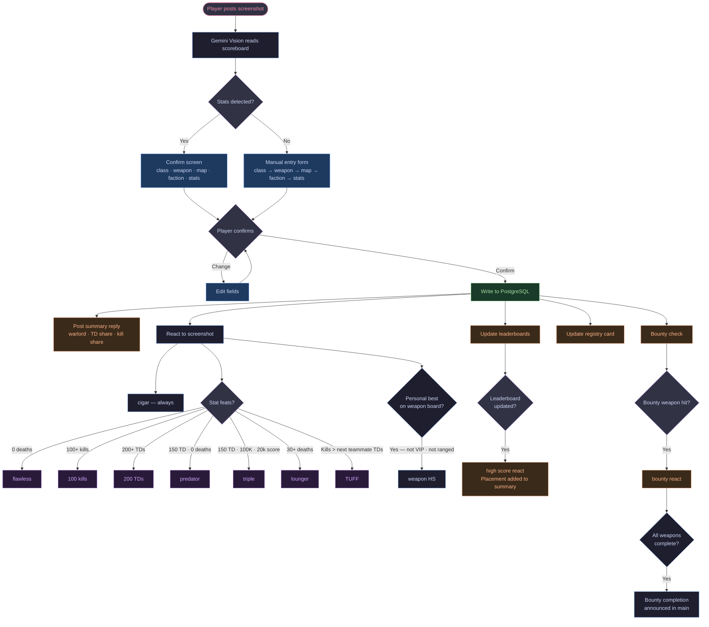

# 🎩 The Butler

> *The lounge does not run itself.*

A Discord bot for the **Cigar Lounge**, a competitive [Chivalry 2](https://www.chivalry2.com/) community. The Butler handles the full submission and tracking pipeline: players post in-game scorecards, and the bot takes it from there.


> 📐 System design & data-flow diagrams: **[docs/ARCHITECTURE.md](docs/ARCHITECTURE.md)**
> 🧭 Codebase map & conventions (start here if you're new): **[CLAUDE.md](CLAUDE.md)**
> 🔧 Symptom → fix cheat sheet: **[docs/TROUBLESHOOTING.md](docs/TROUBLESHOOTING.md)**
> 🛡️ Mod command reference: **[ADMIN_COMMANDS.md](ADMIN_COMMANDS.md)**

---

## Features

### 📋 Submission Flow
Players post a screenshot of their in-game scorecard. Vision AI (Gemini) reads the stats automatically. Players confirm class and weapon, then the Butler logs the run to the database. Includes VIP detection, triple-kill verification, emoji reactions, and a formatted confirmation reply with an edit button. Vision failures fall back to a manual entry form.

The submission blurb includes live team context parsed from the scoreboard image: warlord emoji + TD share percentage, kill share percentage with lethality emoji, and feat reactions for notable runs.



### 🏆 Leaderboards
Live weapon leaderboards for all 1H and 2H weapons, plus map boards and feat boards. Multi-message chunking handles large boards. Shared weapons across subclasses are deduplicated by `(weapon, subclass)` key.

### 📇 Registry Cards
Per-player forum threads in the Butler's Archive. Weapon marks are merged from live submissions, leaderboard data, and legacy records. Includes class rank progression, personal bests, and Best Placements sorted by dominance gap (gap between 1st and 2nd place). `/repair_marks` backfills missing High Score marks in bulk.

### 🎖️ Butler's Report
Weekly stats and all-time prestige titles posted as a Discord embed. Titles recalculated after every submission — one holder per title at a time, with a stability margin so a title only changes hands when a challenger clearly beats the current holder. Weekly stats reset each Monday.

| Title | Criteria |
|---|---|
| **Grand Marshal** | Most leaderboard breadth — 15+ boards across all categories, ranked by average placement |
| **Weapons Master** | 9+ weapon leaderboards, ranked by average placement |
| **Campaign Master** | 6+ map leaderboards, ranked by average placement |

Weekly stats include **Lethality** (kills per takedown), **Warlord** (your share of your team's takedowns), Busiest player, Top Weapons, and Top Maps. The Lethality and Warlord ratings use a recency-weighted, volume-adjusted (Bayesian) average, so a handful of lucky games can't top the board — 3-run minimum.

### 🎯 Bounty System
Monthly bounty cards with per-player progress tracking, a live Top Hunters board, and archival on completion. Supports per-weapon custom targets. Player commands: `/bounty_hunt`, `/my_bounty`, `/bounty_status`.

### 🗂 Ledger Entrance
A master index channel linking to every forum section in sidebar order: challenge rules, Butler's favourites, active bounty, archive, map records, 2H weapons, 1H weapons, and feats of war. Bounty emoji rotates with the active bounty. Rebuilt automatically after leaderboard updates and on demand via `/ledger_refresh`.

### 🧠 Nerve Center Digest
Hourly summary posted to a private channel covering submissions, milestones, Butler interactions, and keyword mentions. Cross-container dedup prevents double-posts on rolling deploys. Silent when there is nothing to report.

### ⚠️ Anomaly Detection
Flags suspicious runs to a private notes channel when stats exceed 2x the server record or a leaderboard gap exceeds 80%. `/remove_submission` rolls back fraudulent entries; `/unlist_submission` toggles a legit-but-unfair run (lopsided lobby, farm game) off all boards and records while keeping its marks and bounty progress.

### 🃏 Butler Personality
Dry, sardonic responses to pings and unprompted one-liners in the main channel every few hours. Dry-spell warnings after 48 hours of inactivity. Answers player questions about stats, leaderboard standings, and Hundred Handed progress using live database context. Powered by Claude Haiku.

---

## Tech Stack

| Layer | Tool |
|---|---|
| Language | Python 3.13 |
| Bot framework | discord.py 2.x |
| Data | PostgreSQL (asyncpg) |
| AI — Butler chat | Anthropic Claude Haiku |
| AI — Scoreboard vision | Google Gemini Flash |
| Hosting | Railway (auto-deploy on push) |
| Version control | GitHub |

---

## Running It / Development

```bash
git clone <this repo>
cd CigarLoungeButler
python -m venv .venv && source .venv/bin/activate   # Windows: .venv\Scripts\activate
pip install -r requirements.txt
python bot.py
```

Environment variables (via `.env` locally, Railway variables in production):

| Variable | Required | Purpose |
|---|---|---|
| `DISCORD_TOKEN` | ✅ | Bot token |
| `DATABASE_URL` | for real use | Postgres connection string. The bot boots without it, but nearly everything needs it. Apply `schema.sql` once; later migrations run automatically at startup. |
| `ANTHROPIC_API_KEY` | optional | Butler chat/quips (falls back to canned lines) |
| `GOOGLE_AI_API_KEY` | optional | Scorecard vision (falls back to manual entry) |
| `KOFI_TOKEN` | optional | Ko-fi webhook verification (`POST /kofi`) |
| `PORT` | optional | Healthcheck server port (default 8080) |

All server-specific IDs (guild, channels, roles, emojis) live in `config.py`; a
fork pointed at a different server needs those replaced. Tests are pure-logic
and need no Discord or DB: `pytest -q`.

Before writing code, read **[CLAUDE.md](CLAUDE.md)**. It covers the row
shapes, the hot-path query rules, and known gotchas.

---

## Architecture Notes

- **Submission queue** serialises concurrent submissions per guild to prevent race conditions
- **PostgreSQL via asyncpg** replaced Google Sheets as the data layer; all reads/writes go through `utils/db.py`
- **Registry cards** edited in-place (never deleted or recreated) for stable thread ID references
- **Shared weapons** keyed as `(weapon, subclass)` tuples to prevent double-counting across subclasses
- **Discord cache** falls back to `fetch_channel()` / `fetch_thread()` after restarts
- **Bulk imports** suppress per-card updates and milestone announcements; index rebuilt once at completion
- **Manual feat count floors** allow mods to correct historical undercounts via `/set_feat_count` without suppressing future auto-detection

---

*Private repository. Contributions by invitation. If that's you, start with [CLAUDE.md](CLAUDE.md) and [docs/ARCHITECTURE.md](docs/ARCHITECTURE.md).*
