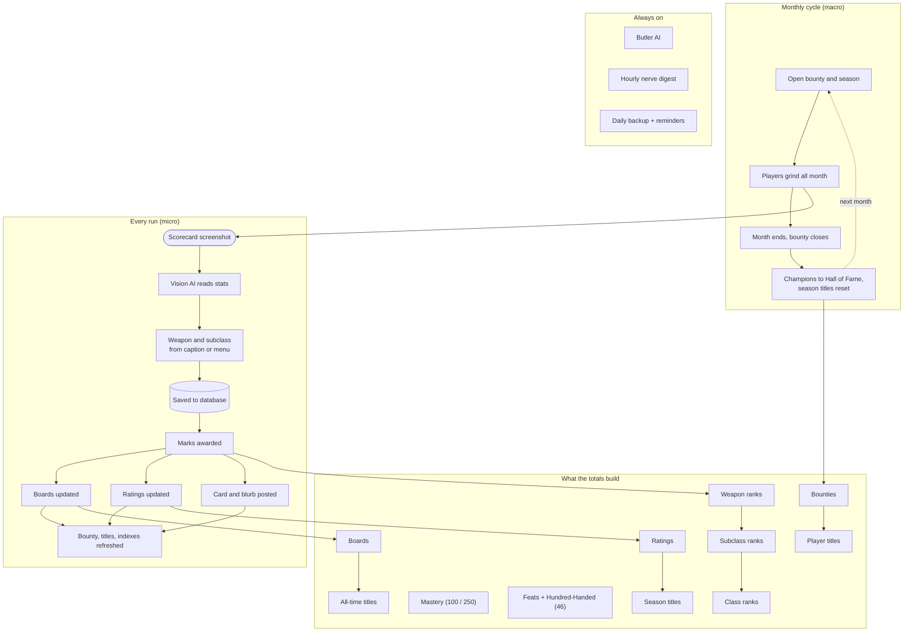
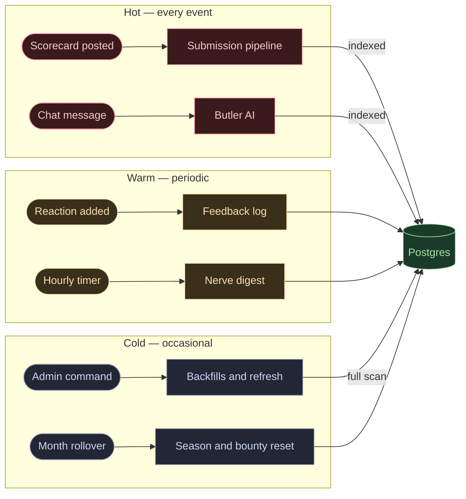

# Architecture

A high-level map of how the Butler works. These diagrams are deliberately structural — they only change if the system is re-architected, not when a threshold or title is tweaked — so they should stay accurate with little upkeep. For per-value detail (rank thresholds, feat rules, titles) see the challenge rules and `config.py`.

## How a run becomes a leaderboard entry

The bot runs on two clocks: a **monthly cycle** (a bounty and season open together and run about a month) and a **per-run pipeline** that fires every time a player posts a scorecard. Marks, boards, and ratings from each run feed the progression and recognition systems; weapon ranks, marks, and all-time titles carry over between months, while season titles reset.

## Where the load is (and why the queries look the way they do)

Not all paths run equally often. The **hot** paths run on *every* submission and *every* chat message; the **warm** paths run periodically; the **cold** paths run occasionally, usually triggered by a mod on purpose.

Everything ultimately reads and writes Postgres, so the busier a path is, the more it matters that the database does the filtering, sorting, and counting rather than the bot loading whole tables into Python. The hot paths use **index-backed, targeted queries** (e.g. `get_leaderboard_by_board`, `get_submissions_by_player`) and SQL aggregates (`MAX`, `COUNT`). The cold paths still do full-table scans — that's fine, because they run rarely.

> **Note to future maintainers:** the targeted queries and SQL aggregates on the hot paths are intentional. Please don't "simplify" them back into `get_all_*` full-table scans — that reintroduces an O(rows) cost on the busiest paths. See the `_INDEXES` list in `utils/db.py`.

## Pure logic and tests

Rank / title / Hundred-Handed math lives in `utils/ranks.py` (no Discord or DB dependencies) so it can be imported and unit-tested in isolation. `tests/test_ranks.py` locks the tier boundaries, the Apex/Ascended/Legend caps, mastery vs virtuoso thresholds, and `HH_TOTAL == 46`. Run the suite with `pytest -q`.
